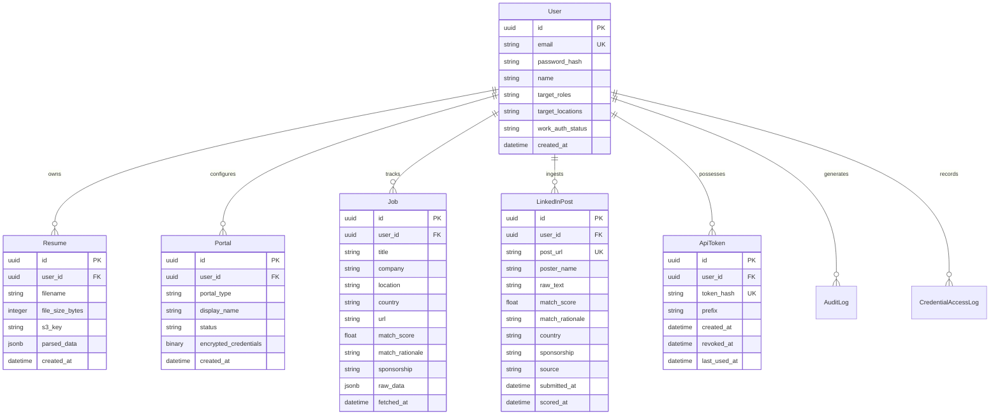

# Architectural & Design Specifications

This document details the architectural decisions, design patterns, security controls, database schema, and LLM orchestration flow for the **Job Application Assistant**.

---

## 1. System Architecture

```
                               ┌────────────────────────────────────────────────────────┐
                               │                     User Browser                       │
                               │                                                        │
                               │  ┌────────────────────────┐    ┌────────────────────┐  │
                               │  │   Vite + React SPA     │    │ Chrome Extension   │  │
                               │  │   (Tailwind CSS v4)    │    │ (Manifest V3)      │  │
                               │  └────────────────────────┘    └────────────────────┘  │
                               └──────────────┬────────────────────────────┬────────────┘
                                              │ HTTP                       │ HTTP (API Token)
                                              ▼                            ▼
                               ┌────────────────────────────────────────────────────────┐
                               │                    FastAPI Backend                     │
                               │                                                        │
                               │  ┌────────────────────────┐    ┌────────────────────┐  │
                               │  │    REST API Routers    │───▶│  BackgroundTasks   │  │
                               │  │  (Auth, Jobs, LinkedIn)│    │(Resume Parse/Score)│  │
                               │  └────────────────────────┘    └──────────┬─────────┘  │
                               └──────────────┬────────────────────────────┼────────────┘
                                              │ SQLAlchemy                 │ LLM API
                                              ▼                            ▼
                               ┌───────────────────────────┐    ┌────────────────────┐
                               │        PostgreSQL         │    │      Groq API      │
                               │      (Alembic DB)         │    │ (Llama-3.3-70b-v)  │
                               └───────────────────────────┘    └────────────────────┘
```

The system is designed as a lightweight, single-process FastAPI web server that handles request routing, database connection pools, local/S3 uploads, and runs in-process async background workers using FastAPI `BackgroundTasks`.

---

## 2. Authentication & Authorization Flow

### 2.1 Passwordless Login (OTP)
1. **Request:** User enters their email.
   - Limit: 5 requests per minute per email (Redis-based rate limit).
   - Backend generates a 6-digit OTP, stores it in Redis with a 10-minute TTL, and sends it via Resend.
2. **Verification:** User submits the 6-digit OTP.
   - Limit: 10 attempts per minute per IP (Redis-based rate limit).
   - If verification fails 5 times, the OTP is immediately deleted from Redis, forcing a new request.
   - Upon success, backend returns a short-lived (15-minute) JWT Access Token.
   - A Refresh Token is set in a secure, `httpOnly`, `SameSite` environment-conditional cookie (Lax/Secure=False for local, None/Secure=True for production).

### 2.2 JWT Verification (Type-Claim Anti-Confusion)
To avoid JWT token confusion:
- Access Tokens carry `type: "access"`.
- Refresh Tokens carry `type: "refresh"`.
- All decode/verification calls assert the expected `type` claim explicitly.
- Access token is kept strictly in React memory (Zustand state) to mitigate XSS risks.

### 2.3 CSRF Protection on Token Refresh
The `/auth/refresh` endpoint requires:
1. The Refresh Token cookie (automatic browser delivery).
2. The expired JWT Access Token in the `Authorization: Bearer <token>` header as CSRF proof (submitting client ownership verification).

---

## 3. Database Schema

The database is managed using Alembic migrations under `backend/db/migrations/`.



---

## 4. Encryption Architecture (Envelope Pattern)

To protect third-party portal credentials stored in the database:
1. **Master Key:** A 256-bit Fernet key supplied via `ENCRYPTION_MASTER_KEY` environment variable.
2. **User Data Key:** Each user has a unique data key generated during signup. This key is encrypted by the Master Key and stored in the `User` table.
3. **Data Encryption:** When a user configures a portal, a fresh Fernet instances uses the user's decrypted data key to encrypt the credentials before writing to the `Portal.encrypted_credentials` column.

### 4.1 Master Key Rotation
The rotation script (`backend/scripts/rotate_master_key.py`) facilitates secure rotation:
1. Re-encrypts all User Data Keys using the new `ENCRYPTION_MASTER_KEY_NEW`.
2. Leaves encrypted credentials untouched, avoiding decryption of raw credentials.
3. Fully idempotent and atomic.

---

## 5. LLM Matching & Ingestion Flows

### 5.1 Resume Parsing
- **Trigger:** PDF or DOCX file upload.
- **Mechanism:** Text is extracted and sent to the LLM (Groq Llama-3.3-70b-v) with structural instructions.
- **Output:** Parsed JSON specifying target roles, skills, experience, and years of experience.

### 5.2 Job Match Scoring
- **Trigger:** Fetch cycle or manual post upload.
- **Process:** Unscored jobs are grouped and matched against the user's parsed resume details.
- **Prompting:** The LLM returns a structured JSON containing a match score (0-100), logical rationale, visa sponsorship indication, and identified country.

---

## 6. Chrome Extension

The extension acts as a silent background parser:
1. **Content Script:** Injects a `MutationObserver` on LinkedIn feeds, checking posts against hiring keyword regexes.
2. **Deduplication:** Maintains an in-memory set of post URLs to prevent duplicate ingestions.
3. **API Relay:** Sends matched posts to the backend's `/linkedin-posts/ingest` endpoint using a long-lived extension API token (`jaa_...`).
